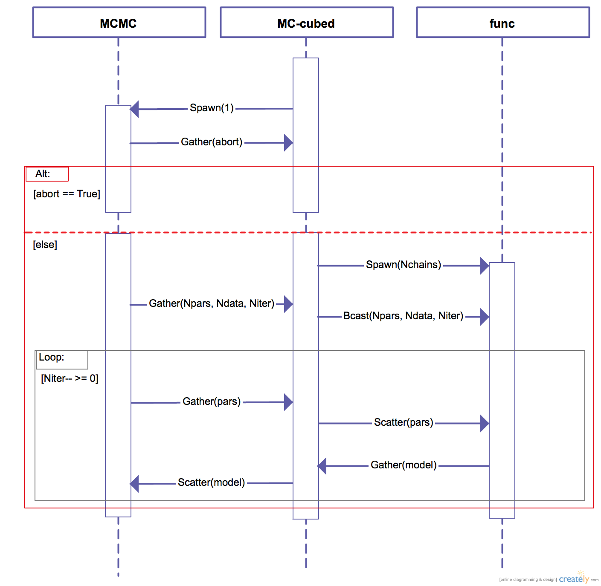
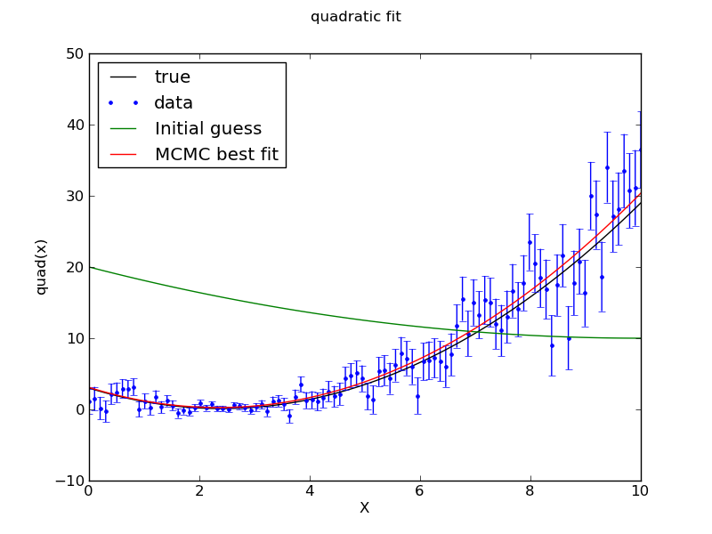
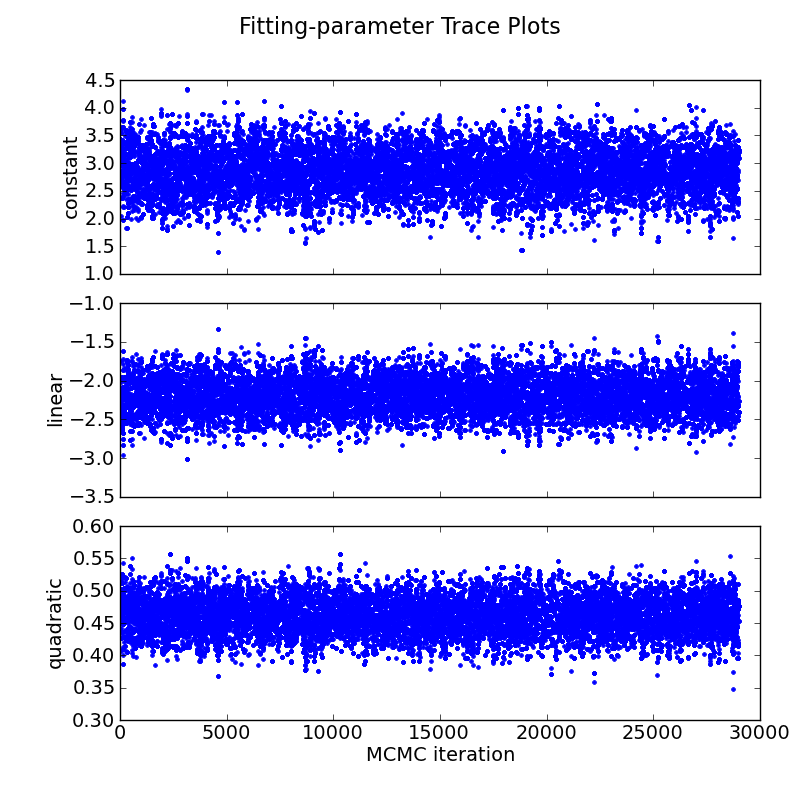

## Multi-core Markov-chain Monte Carlo (MC<sup>3</sup>)
>A python implementation of the Markov-chain Monte Carlo algorithm.

### Table of Contents:
* [Team Members](#team-members)
* [Code Description](#code-description)
* [Install and Compile](#install-and-compile)
* [Interpreter Quick Examples](#interpreter-quick-example)
* [Shell Quick Examples](#shell-quick-example)
* [System Requirements](#system-requirements)
* [Further Reading](#further-reading)
* [Be Kind](#be-kind)
* [License](#license)


<!--  * [Coming up](#coming-up)
-->


### Team Members:
* [Patricio Cubillos](https://github.com/pcubillos/) (author) <pcubillos@fulbrightmail.org>
* Madison Stemm
* Joe Harrington
* [AJ Foster](http://aj-foster.com)
* Nate B. Lust

### Code Description:
**TL;DR:** You provide the data and the model function, I'll give you the parameter posteriors.

MC<sup>3</sup> provides a set of routines to sample the posterior probability distributions for the model-fitting parameters.  To do so it uses Bayesian Inference through a Markov-chain Monte Carlo algorithm following, either, Differential-Evolution (recomended) or Metropolis Random Walk. It handles Bayesian priors, Gelman-Rubin convergence test, or shared parameters (p<sub>j</sub>=p<sub>i</sub>) over the MCMC iterations.  You can run MC<sup>3</sup> interactively through the python interpreter or from the terminal command line.

Get the extended MC3 documentation [here](doc/MC3_documentation.pdf).

**Main modules summary** (project's [source](src/) code):
* mcmc.py
> Core module that implements the MCMC algorithm.

* mccubed.py
> Wrapper of mcmc.py that provides support for MPI multiprocessing and use of configuration files.

* func.py
> Subroutine of mccubed.py that handles the model function in parallel under MPI.

* mcutils.py
> Utility functions used in the project's code.

* mcplots.py
> A set of functions to plot parameter trace curves, pairwise posterior dostributions, and marginalized posterior histograms.

<!--
The following sequence diagram (UML 2.0) details the interaction of the code modules under MPI:
<dl >
  
</dl>
-->

### Install and Compile:

To obtain the latest MCcubed code, clone the repository to your local machine with the following terminal commands.  First, create a top-level directory to place the code:  
```shell
mkdir MC3_demo/  
cd MC3_demo/  
topdir=`pwd`
```

Clone the repository to your working directory:  
```shell
git clone https://github.com/pcubillos/MCcubed 
```

Compile the C code:  
```shell
cd $topdir/MCcubed/src/cfuncs  
make  
```

To remove the program binaries, execute (from the respective directories):  
```shell
make clean
```

The [examples](examples/) folder contains detailed examples to run MC<sup>3</sup> from an interactive Python sesion and from the shell.  But, here below are a couple of quick demo runs anyways.

### Interpreter Quick Example:


```python
import sys
import numpy as np
import matplotlib.pyplot as plt
sys.path.append("../MCcubed/src/")
import mccubed as mc3
import mcplots as mp

# Get function to model (and sample):
sys.path.append("../MCcubed/examples/")
from quadratic import quad

# Create a synthetic dataset:
x = np.linspace(0, 10, 100)          # Independent model variable
p0 = 3, -2.4, 0.5                    # True-underlying model parameters
y = quad(p0, x)                      # Noiseless model
uncert = np.sqrt(np.abs(y))          # Data points uncertainty
error = np.random.normal(0, uncert)  # Noise for the data
data = y + error                     # Noisy data set


# To see the MCMC docstring run:
help(mc3.mcmc)

# Fit the quad polynomial coefficients:
params = np.array([ 20.0, -2.0, 0.1])  # Initial guess of fitting params.

# Run the MCMC:
allp, bp = mc3.mcmc(data, uncert, func=quad, indparams=[x],
                    params=params, numit=3e4, burnin=100)

# That's it, now let's see the results:
y0 = quad(params, x)  # Initial guess values
y1 = quad(bp,     x)  # MCMC best fitting values

plt.figure(10)
plt.clf()
plt.plot(x, y, "-k", label='true')
plt.errorbar(x, data, yerr=uncert, fmt=".b", label='data')
plt.plot(x, y0, "-g", label='Initial guess')
plt.plot(x, y1, "-r", label='MCMC best fit')
plt.legend(loc="best")
plt.xlabel("X")
plt.ylabel("quad(x)")
plt.suptitle("quadratic fit")
plt.savefig("quad_fit.png")

# The module mcplots provides helpful plotting functions:
# Plot trace plot:
parname = ["constant", "linear", "quadratic"]
mp.trace(allp, title="Fitting-parameter Trace Plots", parname=parname,
         savefile="quad_trace.png")

# Plot pairwise posteriors:
mp.pairwise(allp, title="Pairwise posteriors", parname=parname,
         savefile="quad_pairwise.png")

# Plot marginal posterior histograms:
mp.histogram(allp, title="Marginal posterior histograms", parname=parname,
         savefile="quad_hist.png")
```
<dl >
  
  
</dl>

<dl>
  
  
</dl>

### Shell Quick Example:

Create a working directory to place the files and execute the program:
```shell
cd $topdir
mkdir run
cd run
```

Copy the demo files to run MC3 (configuration and data files):
```shell
cp $topdir/MCcubed/examples/example02/* .
```

Call the MC3 executable, providing the configuration file as command-line argument:  
```shell
mpirun $topdir/MCcubed/src/mccubed.py -c demc_demo.cfg
```

###  System Requirements:
<!--
Download the latest MC<sup>3</sup> stable version from the [Releases](https://github.com/pcubillos/MCcubed/releases) page, and start using it.  
-->
This version of the code was implemented with Python 2.7.6.  In addition to the basic built-in Python libraries, you will need:  
- numpy
- matplotlib
- mpi4py  (only required for multi-core runs)

### Further Reading:
Differential-evolution Markov chain algorithm:
[ter Braak 2006: A Markov Chain Monte Carlo version of the genetic algorithm Differential Evolution](http://dx.doi.org/10.1007/s11222-006-8769-1).

Wavelet Likelihood: [Carter & Winn 2009: Parameter Estimation from Time-series Data with Correlated Errors](http://adsabs.harvard.edu/abs/2009ApJ...704...51C).

### Be Kind:
Please reference this paper if you found this module useful for your research:  
  [Cubillos et al. 2014: On the Correlated Noise Analyses Applied to Exoplanet Light Curves](https://github.com/pcubillos/demc/), in preparation.  
Thanks!

### License:
Multi-Core Markov-chain Monte Carlo (MC3), a code to estimate
model-parameter best-fitting values and Bayesian posterior
distributions.

This project was completed with the support of the NASA Planetary
Atmospheres Program, grant NNX12AI69G, held by Principal Investigator
Joseph Harrington.  Principal developers included graduate student
Patricio E. Cubillos and programmer Madison Stemm.  Statistical advice
came from Thomas J. Loredo and Nate B. Lust.

Copyright (C) 2015 University of Central Florida.  All rights reserved.

This is a test version only, and may not be redistributed to any third
party.  Please refer such requests to us.  This program is distributed
in the hope that it will be useful, but WITHOUT ANY WARRANTY; without
even the implied warranty of MERCHANTABILITY or FITNESS FOR A PARTICULAR
PURPOSE.

Our intent is to release this software under an open-source,
reproducible-research license, once the code is mature and the first
research paper describing the code has been accepted for publication
in a peer-reviewed journal.  We are committed to development in the
open, and have posted this code on github.com so that others can test
it and give us feedback.  However, until its first publication and
first stable release, we do not permit others to redistribute the code
in either original or modified form, nor to publish work based in
whole or in part on the output of this code.  By downloading, running,
or modifying this code, you agree to these conditions.  We do
encourage sharing any modifications with us and discussing them
openly.

We welcome your feedback, but do not guarantee support.  Please send
feedback or inquiries to:

Patricio Cubillos <pcubillos@fulbrightmail.org>  
Joseph Harrington <jh@physics.ucf.edu>  

or alternatively,

Joseph Harrington and Patricio Cubillos  
UCF PSB 441  
4111 Libra Drive  
Orlando, FL 32816-2385  
USA  

Thank you for using MC3!

