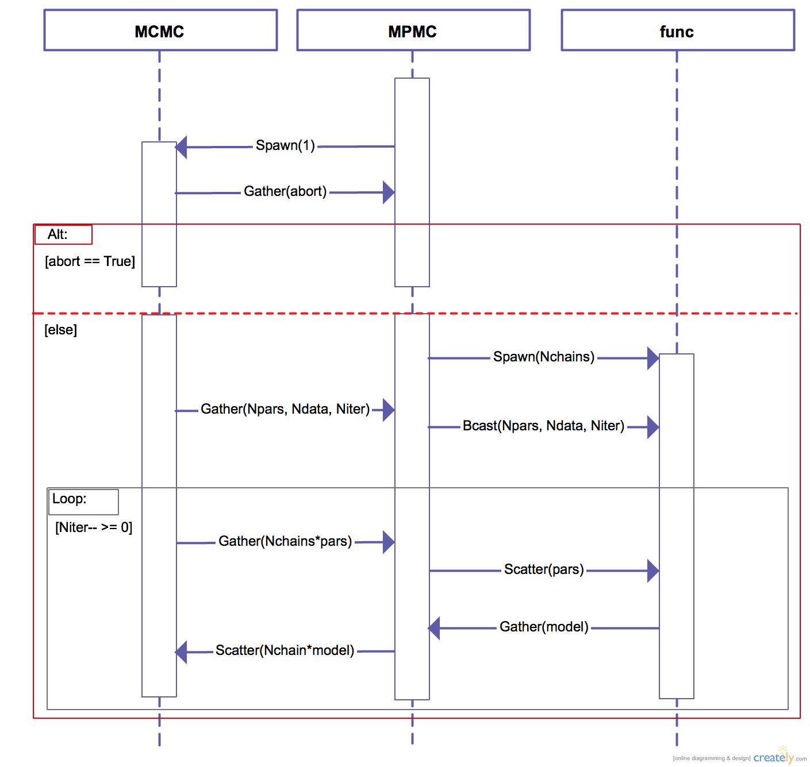
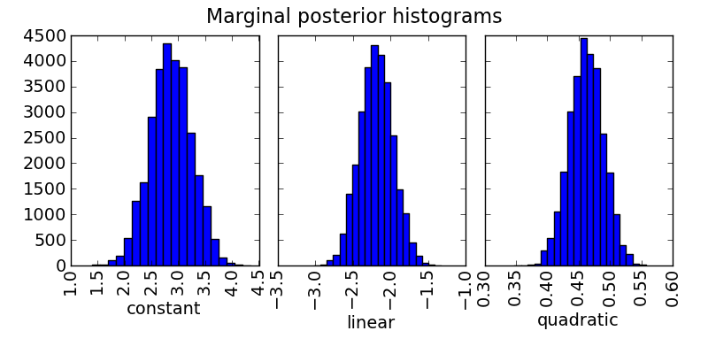

## Multi-processor Markov-chain Monte Carlo (M-cube?)
>A python implementation of the Markov-chain Monte Carlo algorithm.

### Table of Contents:
* [Team Members](#team-members)
* [Code Description](#code-description)
* [Examples](#examples)
* [Installation and System Requirements](#installation-and-system-requirements)
* [Further Reading](#further-reading)
* [License](#license)
 

### Team Members:
* [Patricio Cubillos](https://github.com/pcubillos/) (author) <pcubillos@fulbrightmail.org>
* Madison Stemm
* Joe Harrington

### Code Description:
M-cube provides a set of routines to sample the posterior probability distributions for the model-fitting parameters.  To do so it uses Bayesian Inference through a Markov-chain Monte Carlo algorithm following, either, Differential-Evolution (recomended) or Metropolis Random Walk. It handles Bayesian priors, Gelman-Rubin convergence test.

**TL;DR:** You provide the data and the model function, I'll give you the parameter posteriors.


**Modules summary** (project's [source](src/) code):
* mcmc.py
> Core module that implements MCMC.

* mpmc.py
> Wrapper of mcmc.py that provides the MPI multiprocess support.

* func.py
> Subroutine of mpmc.py to handles the model function in parallel under MPI.

* mcutils.py
> Utility functions used in the project's code.

* mcplots.py
> A set of functions to plot parameter trace curves, pairwise posterior dostributions, and marginalized posterior histograms.

The following sequence diagram (UML 2.0) details the interaction of the code modules under MPI:


### Examples:
The [examples](examples/) folder contains two working examples to test M-cube: (1) from an interactive python session and (2) from the shell. 

Bash code:

```python
import sys
import numpy as np
import matplotlib.pyplot as plt
sys.path.append("./src")
import mcmc as mcmc
import mcplots as mp

# Get function to model/sample.
sys.path.append("./examples/example01")
from quadratic import quad

# Create a synthetic dataset:
x = np.linspace(0, 10, 100) # Independent model variable
p0 = 3, -2.4, 0.5 # True-underlying model parameters
y = quad(p0, x) # Noiseless model
uncert = np.sqrt(np.abs(y)) # Data points uncertainty
error = np.random.normal(0, uncert) # Noise for the data
data = y + error # Noisy data set

# Set the MCMC arguments:
# -----------------------
# Run: 'help(mcmc.mcmc)' to see a quick description of the MCMC arguments.

# Fit the quad polynomial coefficients:
params = np.array([ 20.0, -2.0, 0.1]) # Initial guess of fitting params.

# Run the MCMC:
allp, bp = mcmc.mcmc(data, uncert, func=quad, indparams=[x],
                     params=params, numit=3e4, burnin=100)

y0 = quad(params, x) # Initial guess values
y1 = quad(bp, x) # MCMC best fitting values

plt.figure(10)
plt.clf()
plt.plot(x, y, "-k", label='true')
plt.errorbar(x, data, yerr=uncert, fmt=".b", label='data')
plt.plot(x, y0, "-g", label='Initial guess')
plt.plot(x, y1, "-r", label='MCMC best fit')
plt.legend(loc="best")
plt.xlabel("X")
plt.ylabel("quad(x)")

# The module mcplots provides helpful plotting functions:
# Plot trace plot:
parname = ["constant", "linear", "quadratic"]
mp.trace(allp, title="Fitting-parameter Trace Plots", parname=parname)
mp.trace(allp, title="Fitting-parameter Trace Plots", parname=parname,
         savefile="quad_trace.png")

# Plot pairwise posteriors:
mp.pairwise(allp, title="Pairwise posteriors", parname=parname,
         savefile="quad_pairwise.png")

# Plot marginal posterior histograms:
mp.histogram(allp, title="Marginal posterior histograms", parname=parname,
         savefile="quad_hist.png")
```         
Trace plot:


Pairwise posterior:


Posterior histogram:



### Installation and System Requirements:
M-cube is a pure python code and doesn't need an installation, simply download the code and start using it.

**System Requirements:**
- The basic built-in Python libraries (os, sys, warnings, argparse, ConfigParser, subprocess, timeit, time)
- numpy
- matplotlib
- mpi4py

### Further Reading:
The differential-evolution Markov chain algorithm is further detailed in
[Braak 2006: A Markov Chain Monte Carlo version of the genetic algorithm Differential Evolution](http://dx.doi.org/10.1007/s11222-006-8769-1)


### License:
Copyright (c) 2014 Patricio Cubillos

Permission is hereby granted, free of charge, to any person obtaining a copy of this software and associated documentation files (the "Software"), to deal in the Software without restriction, including without limitation the rights to use, copy, modify, merge, publish, distribute, sublicense, and/or sell copies of the Software, and to permit persons to whom the Software is furnished to do so, subject to the following conditions:

The above copyright notice and this permission notice shall be included in all copies or substantial portions of the Software.

THE SOFTWARE IS PROVIDED "AS IS", WITHOUT WARRANTY OF ANY KIND, EXPRESS OR IMPLIED, INCLUDING BUT NOT LIMITED TO THE WARRANTIES OF MERCHANTABILITY, FITNESS FOR A PARTICULAR PURPOSE AND NONINFRINGEMENT. IN NO EVENT SHALL THE AUTHORS OR COPYRIGHT HOLDERS BE LIABLE FOR ANY CLAIM, DAMAGES OR OTHER LIABILITY, WHETHER IN AN ACTION OF CONTRACT, TORT OR OTHERWISE, ARISING FROM, OUT OF OR IN CONNECTION WITH THE SOFTWARE OR THE USE OR OTHER DEALINGS IN THE SOFTWARE.
