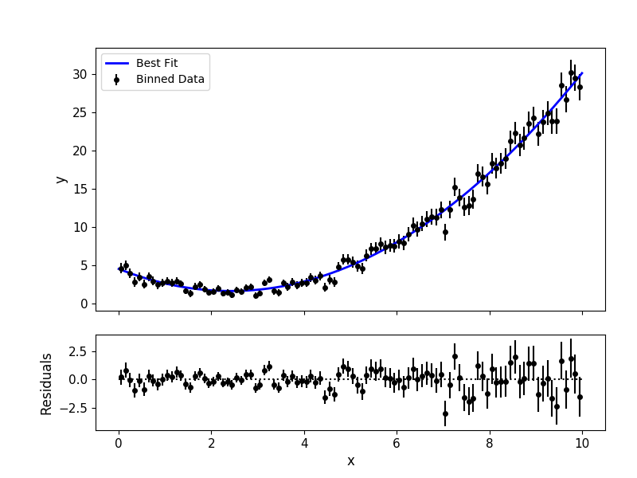

.. _fittutorial:

Optimization Tutorial
=====================

This tutorial describes ``MC3``'s optimization function ``mc3.fit()``,
which provides model-fitting optimization through ``scipy.optimize``'s
``leastsq`` (Levenberg-Marquardt) and ``least_squares`` (Trust Region
Reflective) routines.

As additional features, one can include (two-sided) Gaussian priors,
set shared parameters, and fix parameters.  The ``mc3.fit()`` arguments
work similarly to those of the ``mc3.mcmc()`` function.

Basic Fit
---------

This is the function's calling signature:

.. py:module:: mc3

.. py:function:: fit(data, uncert, func, params, indparams=[], pstep=None, pmin=None, pmax=None, prior=None, priorlow=None, priorup=None, leastsq='lm')
    :noindex:

In the most basic form, the user only needs to provide the fitting
parameters and function, the data and :math:`1\sigma`-uncertainties
arrays, (and any additional argument to the fitting function).  This
will perform a Levenberg-Marquardt fit.  The function returns a
dictionary containing the best-fitting parameters, chi-square, and
model, and the output from the ``scipy`` optimizer.  See the example
below:

.. np.random.seed(314)

.. code-block:: python

    import numpy as np
    import mc3

    def quad(p, x):
        """Quadratic polynomial: y(x) = p0 + p1*x + p2*x^2"""
        return p[0] + p[1]*x + p[2]*x**2.0

    # Preamble (create a synthetic dataset, in a real scenario you would
    # get your dataset from your own data analysis pipeline):
    x  = np.linspace(0, 10, 1000)
    p0 = [4.5, -2.4, 0.5]
    y  = quad(p0, x)
    uncert = np.sqrt(np.abs(y))
    data   = y + np.random.normal(0, uncert)

    # Fit the data:
    output = mc3.fit(data, uncert, quad, [4.5, -2.0, 0.1], indparams=[x])

    print(list(output.keys()))
    ['chisq', 'bestp', 'best_model', 'optimizer_res']

    print(output['bestp'])
    [ 4.56085134 -2.38922738  0.49434268]

    print(output['chisq'])
    1035.0055203471165

    # Plot data and best-fitting model:
    mc3.plots.modelfit(data, uncert, x, output['best_model'], nbins=100)

Data and Uncertainties
----------------------

The ``data`` and ``uncert`` arguments are 1D arrays that set the data
and :math:`1\sigma` uncertainties to be fit.

Modeling Function
-----------------

The ``func`` argument is a callable that defines the parameterized
modeling function fitting the data.  The only requirement for the
modeling function is that its arguments follow the same structure of
the callable in ``scipy.optimize.leastsq``, i.e., the modeling
function has to able to be called as: ``model = func(params,
*indparams)``

The ``params`` argument is a 1D array containing the initial-guess
values for the model fitting parameters.

The ``indparams`` argument (optional) contains any additional argument
required by ``func``.  

.. note:: Even if there is only one additional argument to ``func``,
    ``indparams`` must be defined as a list (as in the example
    above).

Optimization Algorithm
----------------------

Set ``leastsq='lm'`` to
use the Levenberg-Marquardt algorithm (default) via `Scipy's leastsq
<https://docs.scipy.org/doc/scipy/reference/generated/scipy.optimize.leastsq.html#scipy.optimize.leastsq>`_,
or set ``leastsq='trf'`` to use the Trust Region Reflective algorithm
via `Scipy's least_squares
<https://docs.scipy.org/doc/scipy/reference/generated/scipy.optimize.least_squares.html#scipy.optimize.least_squares>`_.
Fixed and shared-values apply during the optimization (see
:ref:`behavior`), as well as the priors (see :ref:`priors`).

.. note:: From the `scipy
          <https://docs.scipy.org/doc/scipy/reference/generated/scipy.optimize.least_squares.html#scipy.optimize.least_squares>`_
          documentation: Levenberg-Marquardt '*doesn't handle bounds*'
          but is '*the most efficient method for small unconstrained
          problems*'; whereas the Trust Region Reflective algorithm is
          a '*Generally robust method, suitable for large sparse
          problems with bounds*'.

The ``pmin`` and ``pmax`` arguments set the parameter lower and upper
boundaries for a ``trf`` optimization, e.g:

.. code-block:: python

    # Fit with the 'trf' algorithm and bounded parameter space:
    output = mc3.fit(data, uncert, quad, [4.5, -2.5, 0.5], indparams=[x],
        pmin=[4.4, -3.0, 0.4], pmax=[5.0, -2.0, 0.6], leastsq='trf')

Fixing and Sharing Paramerers
-----------------------------

The ``pstep`` argument (optional) allows the user to keep fitting
parameters fixed or share their value with another parameter.

A positive ``pstep`` value leaves the parameter free, whereas a ``pstep``
value of zero keeps the parameter fixed. For example:

.. code-block:: python

    # (Following on the script above)
    # Fit the data, keeping the first parameter fixed at 4.5:
    output = mc3.fit(data, uncert, quad, [4.5, -2.0, 0.1], indparams=[x],
        pstep=[0.0, 1.0, 1.0])

    print(output['bestp'])
    [ 4.5        -2.35925975  0.49142448]

A parameter can share the value from another parameter by setting a
negative ``pstep``, where the value of ``pstep`` is equal to the
negative index of the parameter to copy from. For example:

.. code-block:: python

    # (Though, it doesn't truly make sense for this model, let's pretend that the
    #  first and second parameters must have the same value, make a dataset for it:)
    p1 = [4.5, 4.5, 0.5]
    y1 = quad(p1, x)
    uncert1 = np.sqrt(np.abs(y1))
    data1 = y1 + np.random.normal(0, uncert1)

    # Fit the data, enforcing the second parameter equal to the first one:
    output = mc3.fit(data1, uncert1, quad, [4.0, 4.0, 0.1], indparams=[x],
        pstep=[1.0, -1.0, 1.0])

    print(output['bestp'])
    [4.56119139 4.56119139 0.48737614]

.. note:: Consider that in this case, contrary to Python standards,
          the ``pstep`` indexing starts counting from one instead of
          zero (since negative zero is equal to zero).

Parameter Priors
----------------

The ``prior``, ``priorlow``, and ``priorup`` arguments (optional) set the
prior probability distributions of the fitting parameters.
Each of these arguments is a 1D float ndarray.

A ``priorlow`` value of zero (default) sets a uniform prior. This is
appropriate when there is no prior knowledge of the value of a
parameter :math:`\theta`:

.. math::
   p(\theta) = \frac{1}{\theta_{\rm max} - \theta_{\rm min}},

Positive values of ``priorlow`` and ``priorup`` set a Gaussian prior.
This is typically used when a parameters has a previous estimate in
the form of :math:`p(\theta) = {\theta_p\,}^{+\sigma_{\rm
up}}_{-\sigma_\rm{lo}}`, where the
values of ``prior``, ``priorlow`` and ``priorup`` define the prior
value, lower, and upper :math:`1\sigma`
uncertainties, respectively:

.. math::
   p(\theta) = A \exp\left(\frac{-(\theta-\theta_{p})^{2}}{2\sigma_{p}^{2}}\right),

where :math:`\sigma_{p}` adopts the value of :math:`\sigma_{\rm lo}` if :math:`\theta < \theta_p`, or :math:`\sigma_{\rm up}` otherwise.
The leading factor is given by :math:`A = 2/(\sqrt{2\pi}(\sigma_{\rm up}+\sigma_{\rm lo}))` (see [Wallis2014]_).

.. code-block:: python

    # (Following on the script above)
    # Fit, imposing a Gaussian prior on the first parameter at 4.5 +/- 0.1,
    # and leaving uniform priors for the rest:
    prior    = np.array([ 4.5,  0.0,   0.0])
    priorlow = np.array([ 0.1,  0.0,   0.0])
    priorup  = np.array([ 0.1,  0.0,   0.0])
    output = mc3.fit(data, uncert, quad, [4.5, -2.0, 0.1], indparams=[x],
        prior=prior, priorlow=priorlow, priorup=priorup)

    print(output['bestp'])
    [ 4.51420008 -2.3662529   0.49210546]
