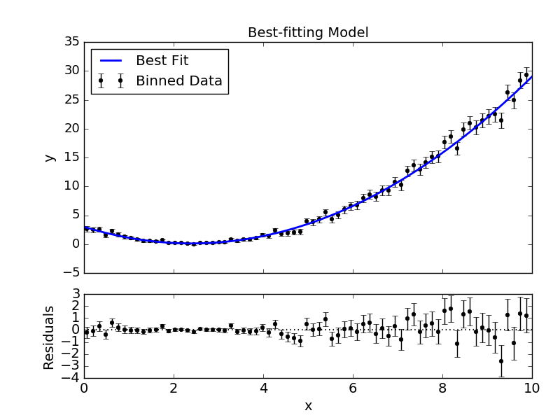

.. _getstarted:

Getting Started
===============

System Requirements
-------------------

``MC3`` is compatible with Python 3.6+, and has been `tested
<https://travis-ci.com/pcubillos/mc3>`_ to work on Unix/Linux and
OS X machines, with the following software:

* Numpy (version 1.15.0+)
* Scipy (version 0.17.1+)
* Matplotlib (version 2.0+)

``MC3`` may work with previous versions of these software;
however, we do not guarantee nor provide support for that.

Install
-------

To install ``MC3``, just run the following command (if you use conda, see instructions below):

.. code-block:: shell

    pip install mc3

Or alternatively (for conda users and for developers), clone the repository to your local machine with the following terminal commands:

.. code-block:: shell

    # Clone the repository to your working directory:
    git clone https://github.com/pcubillos/mc3
    cd mc3
    python setup.py install

``MC3`` provides MCMC and nested-sampling posterior sampling,
optimization and other lower-level statistical and plotting
routines. See the full docs in the :ref:`api` or through the Python
interpreter:

.. code-block:: python

    import mc3
    # MCMC or nested sampling:
    help(mc3.sampling)
    # Optimization:
    help(mc3.fit)
    # Assorted stats:
    help(mc3.stats)
    # Plotting utilities:
    help(mc3.plots)

Example 1: Interactive Run
--------------------------

The following example shows a basic MCMC run from the Python
interpreter, for a quadratic-polynomial fit to a noisy dataset:

.. literalinclude:: ../examples/get_started.py
  :lines: 1-34

That's it.  The code returns a dictionary with the MCMC results.
Among these, you can find the posterior sample
(``posterior``), the best-fitting values (``bestp``),
the lower and upper boundaries of the 68%-credible region (``CRlo``
and ``CRhi``, with respect to ``bestp``), the standard deviation of
the marginal posteriors (``stdp``), among other variables.

``MC3`` will also print out to screen a progress report every 10% of
the MCMC run, showing the time, number of times a parameter tried to
go beyond the boundaries, the current best-fitting values, and
lowest :math:`\chi^{2}`; for example:

.. code-block:: none

  ::::::::::::::::::::::::::::::::::::::::::::::::::::::::::::::::::::::
    Multi-core Markov-chain Monte Carlo (MC3).
    Version 3.0.0.
    Copyright (c) 2015-2019 Patricio Cubillos and collaborators.
    MC3 is open-source software under the MIT license (see LICENSE).
  ::::::::::::::::::::::::::::::::::::::::::::::::::::::::::::::::::::::

  Yippee Ki Yay Monte Carlo!
  Start MCMC chains  (Thu Aug  8 11:07:01 2019)

  [:         ]  10.0% completed  (Thu Aug  8 11:07:01 2019)
  Out-of-bound Trials:
  [0 0 0]
  Best Parameters: (chisq=112.6268)
  [ 3.12818712 -2.53735522  0.51348382]
  Gelman-Rubin statistics for free parameters:
  [1.01018891 1.00754117 1.01020828]

  ...

  [::::::::::] 100.0% completed  (Thu Aug  8 11:07:03 2019)
  Out-of-bound Trials:
  [0 0 0]
  Best Parameters: (chisq=112.5932)
  [ 3.07622279 -2.50383404  0.50898544]
  Gelman-Rubin statistics for free parameters:
  [1.00065724 1.00044997 1.00034891]
  All parameters converged to within 1% of unity.

  MCMC Summary:
  -------------
    Number of evaluated samples:        100002
    Number of parallel chains:               7
    Average iterations per chain:        14286
    Burned-in iterations per chain:       1000
    Thinning factor:                         1
    MCMC sample size (thinned, burned):  93002
    Acceptance rate:   27.68%

  Param name     Best fit   Lo HPD CR   Hi HPD CR        Mean    Std dev       S/N
  ----------- ----------------------------------- ---------------------- ---------
  Param 1      3.0762e+00 -3.9009e-01  3.8081e-01  3.0778e+00 3.8496e-01       8.0
  Param 2     -2.5038e+00 -2.2503e-01  2.1973e-01 -2.5003e+00 2.2042e-01      11.4
  Param 3      5.0899e-01 -2.7631e-02  2.6352e-02  5.0836e-01 2.6877e-02      18.9

    Best-parameter's chi-squared:       112.5932
    Best-parameter's -2*log(posterior): 112.5932
    Bayesian Information Criterion:     126.4088
    Reduced chi-squared:                  1.1608
    Standard deviation of residuals:  3.00568

At the end of the MCMC run, ``MC3`` displays a summary of the MCMC
sample, best-fitting parameters, credible-region boundaries, posterior
mean and standard deviation, among other statistics.

Additionally, the user has the option to generate several plots of the MCMC
sample: the best-fitting model and data curves, parameter traces, and
marginal and pair-wise posteriors (these plots can also be generated
automatically with the MCMC run by setting ``plots=True``).
The plots sub-package provides the plotting functions:

.. literalinclude:: ../examples/get_started.py
  :lines: 38-

.. image:: ./quad_trace.png
   :width: 75%

.. image:: ./quad_pairwise.png
   :width: 75%

.. image:: ./quad_hist.png
   :width: 75%

.. note:: These plots can also be automatically generated along with the
          MCMC run (see :ref:`outputs`).

Example 2: Shell Run
--------------------

The following example shows a basic MCMC run from the terminal using a
configuration file.
First, create a Python file ('*quadratic.py*') with the modeling function:

.. code-block:: python

    def quad(p, x):
        y = p[0] + p[1]*x + p[2]*x**2.0
        return y

Then, generate a data set and store into files, e.g., with the
following Python script:

.. code-block:: python

    import numpy as np
    import mc3
    from quadratic import quad

    # Create synthetic dataset:
    x  = np.linspace(0, 10, 1000)         # Independent model variable
    p0 = [3, -2.4, 0.5]                   # True-underlying model parameters
    y  = quad(p0, x)                      # Noiseless model
    uncert = np.sqrt(np.abs(y))           # Data points uncertainty
    error  = np.random.normal(0, uncert)  # Noise for the data
    data   = y + error                    # Noisy data set
    # Store data set and other inputs:
    mc3.utils.savebin([data, uncert], 'data.npz')
    mc3.utils.savebin([x],            'indp.npz')

Now, create a configuration file with the ``MC3`` setup ('*MCMC.cfg*'):

.. code-block:: shell

    [MCMC]
    data      = data.npz
    indparams = indp.npz

    func     = quad quadratic
    params   =  10.0   -2.0   0.1
    pmin     = -25.0  -10.0 -10.0
    pmax     =  30.0   10.0  10.0
    pstep    =   0.3    0.3   0.05

    nsamples = 1e5
    burnin   = 1000
    ncpu     = 7
    sampler  = snooker
    grtest   = True
    plots    = True
    savefile = output_demo.npz

Finally, call the ``MC3`` entry point, providing the configuration file as
a command-line argument:

.. code-block:: shell

   mc3 -c MCMC.cfg

Troubleshooting
---------------

There may be an error with the most recent version of the
``multiprocessing`` module (version 2.6.2.1).  If the MCMC breaks with
an "AttributeError: __exit__" error message pointing to a
``multiprocessing`` module, try installing a previous version of it with
this shell command:

.. code-block:: shell

   pip install --upgrade 'multiprocessing<2.6.2'

