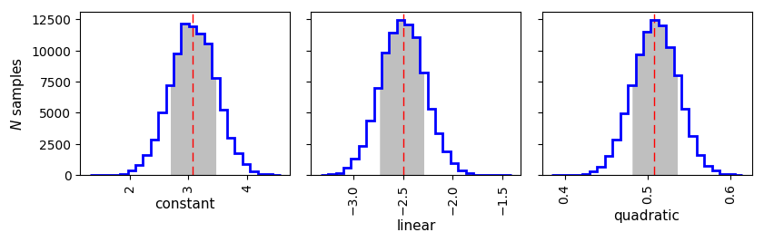
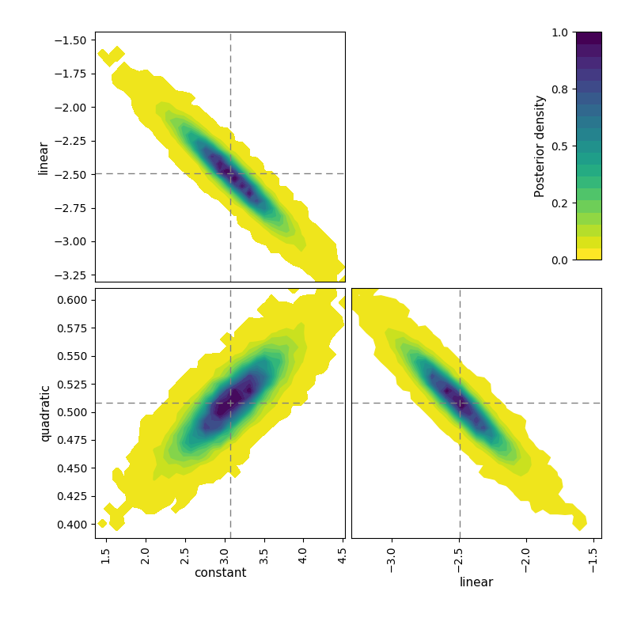
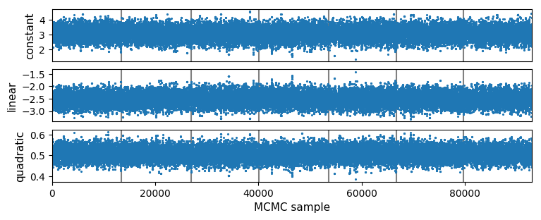

.. _getstarted:

Getting Started
===============

System Requirements
-------------------

``MC3`` (version 1.1) is known to work (at least) on Unix/Linux (Ubuntu)
and OSX (10.9+) machines, with the following software:

* Python (version 2.7)
* Numpy (version 1.8.2+)
* Scipy (version 0.13.3+)
* Matplotlib (version 1.3.1+)
* mpi4py (version 1.3.1+)
* Message Passing Interface, MPI (MPICH preferred) 

``MC3`` may work with previous versions of these software.
However we do not guarantee nor provide support for that.

Install
-------

To obtain the latest MCcubed code, clone the repository to your local machine with the following terminal commands. First, create a top-level directory to place the code:

.. code-block:: shell

  mkdir MC3_demo/
  cd MC3_demo/
  topdir=`pwd`

Clone the repository to your working directory:

.. code-block:: shell

  git clone https://github.com/pcubillos/MCcubed

Compile
-------

Compile the C code:

.. code-block:: shell

  cd $topdir/MCcubed/src/cfuncs
  make

To remove the program binaries, execute (from the respective directories):

.. code-block:: shell

  make clean

..  Documentation
    -------------
  
  To see the MCMC docstring run:
  
  .. code-block:: python
  
     import mccubed as mc3
     help(mc3.mcmc)
 
Example 1 (Interactive)
-----------------------

The following example (`demo01 <https://github.com/pcubillos/MCcubed/blob/master/examples/demo01/demo01.py>`_) shows a basic ``MC3`` MCMC run from the Python interpreter.
This example fits a quadratic polynomial curve to a dataset.
First create a folder to run the example (alternatively, run the example from any location, but adjust the paths of the Python script):

.. code-block:: shell

   cd $topdir
   mkdir run01
   cd run01

Now start a Python interactive session.  This script imports the necesary modules, creates a noisy dataset, and runs the MCMC:

.. code-block:: python

   import sys
   import numpy as np
   import matplotlib.pyplot as plt
   sys.path.append("../MCcubed/src/")
   import mccubed as mc3
   
   # Get function to model (and sample):
   sys.path.append("../MCcubed/examples/models/")
   from quadratic import quad
   
   # Create a synthetic dataset:
   x = np.linspace(0, 10, 100)          # Independent model variable
   p0 = 3, -2.4, 0.5                    # True-underlying model parameters
   y = quad(p0, x)                      # Noiseless model
   uncert = np.sqrt(np.abs(y))          # Data points uncertainty
   error = np.random.normal(0, uncert)  # Noise for the data
   data = y + error                     # Noisy data set
   
   # Fit the quad polynomial coefficients:
   params = np.array([ 20.0, -2.0, 0.1])  # Initial guess of fitting params.
   
   # Run the MCMC:
   allp, bp = mc3.mcmc(data, uncert, func=quad, indparams=[x],
                       params=params, numit=3e4, burnin=100)
   

Outputs
^^^^^^^

That's it, now let's see the results.  ``MC3`` will print out to screen a
progress report every 10% of the MCMC run, showing the time, number of
times a parameter tried to go beyond the boundaries, the current
best-fitting values, and corresponding :math:`\chi^{2}`, like this:

.. code-block:: none

   ::::::::::::::::::::::::::::::::::::::::::::::::::::::::::::::::::::::
     Multi-Core Markov-Chain Monte Carlo (MC3).
     Version 1.1.20.
     Copyright (c) 2015-2016 Patricio Cubillos and collaborators.
     MC3 is open-source software under the MIT license (see LICENSE).
   ::::::::::::::::::::::::::::::::::::::::::::::::::::::::::::::::::::::

   Start MCMC chains  (Tue Jan  5 13:11:22 2016)
   
   ...
  
   [::        ]  20.0% completed  (Tue Jan  5 13:11:22 2016)
   Out-of-bound Trials:
    [0 0 0]
   Best Parameters:   (chisq=87.5664)
   [ 2.81119952 -2.33026943  0.48622898]

   ...

At the end of the MCMC run, ``MC3`` will display a summary of the MCMC sample, best-fitting parameters, uncertainties, mean values, and statistics:

.. code-block:: none

   Fin, MCMC Summary:
   ------------------
    Burned in iterations per chain:   100
    Number of iterations per chain:  3000
    MCMC sample size:               29000
    Acceptance rate:   39.39%
   
    Best-fit params    Uncertainties   Signal/Noise       Sample Mean
      2.8111995e+00    3.8625328e-01           7.28     2.8167688e+00
     -2.3302694e+00    2.2233506e-01          10.48    -2.3308174e+00
      4.8622898e-01    2.7225910e-02          17.86     4.8622772e-01
   
    Best-parameter's chi-squared:      87.5664
    Bayesian Information Criterion:   101.3819
    Reduced chi-squared:                0.9027
    Standard deviation of residuals:  2.5201

.. note:: More information will be displayed, depending on the MCMC configuration (see the :ref:`tutorial`).

The user has the option to generate the best-fitting, trace, and posterior MCMC plots (these plots can also be generated automatically with the MCMC run):

.. code-block:: python

   y0 = quad(params, x)  # Initial guess values
   y1 = quad(bp,     x)  # MCMC best fitting values
   
   plt.figure(10)
   plt.clf()
   plt.plot(x, y, "-k", label='true')
   plt.errorbar(x, data, yerr=uncert, fmt=".b", label='data')
   plt.plot(x, y0, "-g", label='Initial guess')
   plt.plot(x, y1, "-r", label='MCMC best fit')
   plt.legend(loc="best")
   plt.xlabel("X")
   plt.ylabel("quad(x)")
   
.. image:: ./quad_fit.png
   :width: 50%

The mcplots module of ``MC3`` provides the functions to plot the parameter
trace and posteriors:

.. code-block:: python

   # Import the mcplots module:
   import mcplots as mp
   # Plot trace plot:
   parname = ["constant", "linear", "quadratic"]
   mp.trace(allp, title="Fitting-parameter Trace Plots", parname=parname,
            savefile="quad_trace.png")
   
   # Plot pairwise posteriors:
   mp.pairwise(allp, title="Pairwise posteriors", parname=parname,
            savefile="quad_pairwise.png")
   
   # Plot marginal posterior histograms:
   mp.histogram(allp, title="Marginal posterior histograms", parname=parname,
            savefile="quad_hist.png")

Example 2 (Shell Run)
---------------------

The following example (`demo02 <https://github.com/pcubillos/MCcubed/blob/master/examples/demo02/>`_) shows a basic ``MC3`` MCMC run from the Shell prompt.
To start, create a working directory to place the files and execute the program:

.. code-block:: shell

   cd $topdir
   mkdir run02
   cd run02

Copy the demo files to run ``MC3`` (configuration and data files):

.. code-block:: shell

   cp $topdir/MCcubed/examples/demo02/* .

Call the ``MC3`` executable, providing the configuration file as command-line argument:  

.. code-block:: shell

   mpirun $topdir/MCcubed/src/mccubed.py -c MCMC.cfg

