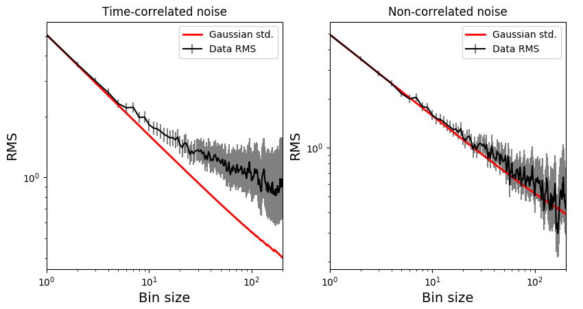

.. _timeaveraging:

Time Averaging
==============

The ``mc3.stats.time_avg()`` routine computes the binned RMS array (as
function of bin size) used in the the time-averaging procedure for a
given model--data residuals array.  The routine returns the RMS of the
binned data (:math:`{\rm rms}_N`), the lower and upper RMS
uncertainties, the extrapolated RMS for Gaussian (white) noise
(:math:`\sigma_N`), and the bin-size array (:math:`N`).

This function uses an asymptotic approximation to compute the RMS
uncertainties (:math:`\sigma_{\rm rms} = \sqrt{{\rm rms}_N / 2M}`) for
number of bins :math:`M> 35`.  For smaller values of :math:`M`
(equivalently, large bin size) this routine computes the errors from
the posterior PDF of the RMS (an inverse-gamma distribution).  For
more details, see [Cubillos2017]_.

Example
^^^^^^^

For the sake of illustration, this example uses mock data.  In the
real world, your 'data' should be the residuals between the observed
values and some model fit:

.. literalinclude:: ../examples/timeavg.py

For a time-correlated signal, the RMS-vs-binsize curve deviates above
the white-noise Gaussian prediction, as in the left panel below.  For
a white-noise signal, both curves should match within uncertainties,
as in the right panel below:

