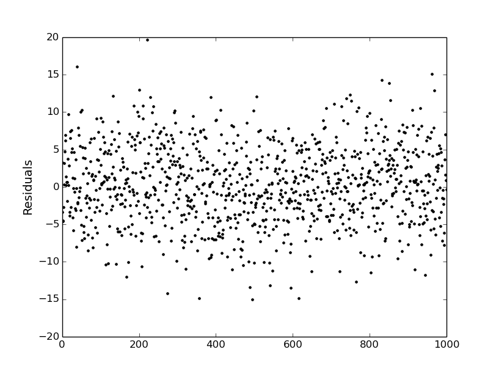

.. _timeaveraging:

Time Averaging
==============

The ``MCcubed.rednoise.binrms`` routine computes the binned RMS array
(as function of bin size) used in the the time-averaging procedure.
Given a (model-data) residuals array.  The routine returns the RMS of
the binend data (:math:`{\rm rms}_N`), the lower and upper RMS
uncertainties, the extrapolated RMS for Gaussian (white) noise
(:math:`\sigma_N`), and the bin-size array (:math:`N`).

This function uses an asymptotic approximation to compute the RMS
uncertainties (:math:`\sigma_{\rm rms} = \sqrt{{\rm rms}_N / 2M}`) for
number of bins :math:`M> 35`.  For smaller values of :math:`M`
(equivalently, large bin size) this routine computes the errors from
the posterior PDF of the RMS (an inverse-gamma distribution).  See
[Cubillos2017]_.

Example
^^^^^^^

.. code-block:: python

  import numpy as np
  import matplotlib.pyplot as plt
  import MCcubed as mc3   # Add path to mc3 if necessary
  plt.ion()

  # Generate residuals signal:
  N = 1000
  # White-noise signal:
  white = np.random.normal(0, 5, N)
  # (Sinusoidal) time-correlated signal:
  red = np.sin(np.arange(N)/(0.1*N))*np.random.normal(1.0, 1.0, N)

  # Plot the time-correlated residuals signal:
  plt.figure(0)
  plt.clf()
  plt.plot(white+red, ".k")
  plt.ylabel("Residuals", fontsize=14)

  # Compute the residuals rms-vs-binsize:
  maxbins = N/5
  rms, rmslo, rmshi, stderr, binsz = mc3.rednoise.binrms(white+red, maxbins)

  # Plot the rms with error bars along with the Gaussian standard deviation curve:
  plt.figure(-6)
  plt.clf()
  plt.errorbar(binsz, rms, yerr=[rmslo, rmshi], fmt="k-", ecolor='0.5', capsize=0, label="Data RMS")
  plt.loglog(binsz, stderr, color='red', ls='-', lw=2, label="Gaussian std.")
  plt.xlim(1,200)
  plt.legend(loc="upper right")
  plt.xlabel("Bin size", fontsize=14)
  plt.ylabel("RMS", fontsize=14)

.. image:: ./rms-vs-binsize.png
   :width: 50%

References
^^^^^^^^^^

.. [Cubillos2017] `Cubillos et al. (2017): On the Correlated-noise
  Analyses Applied to Exoplanet Light Curves
  <http://adsabs.harvard.edu/abs/2017AJ....153....3C>`_
